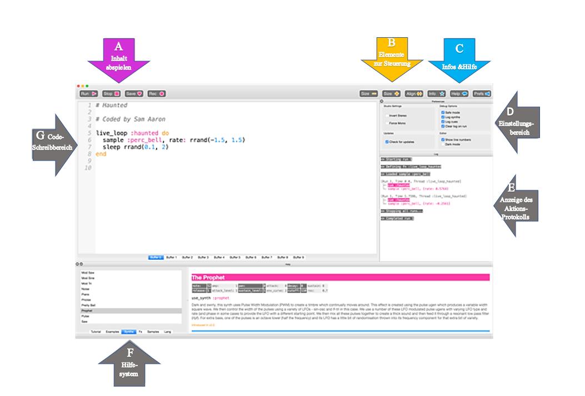

## Erste Sounds mit Sonic Pi



Dies ist die Sonic Pi-Schnittstelle. Sie hat drei Hauptfenster. Der größte ist für das Schreiben deines Codes und wir nennen ihn Programmierbereich. Es gibt auch ein Ausgabefeld, in dem Informationen zu deinem Programm angezeigt werden, während es ausgeführt wird. Wenn du auf die Schaltfläche **help** (auf Deutsch: Hilfe) oben im Fenster klickst, wird das dritte Feld unten angezeigt, in dem die Hilfedokumentation angezeigt wird. Hier findest du Informationen zu verschiedenen Codes, die du ausprobieren und verwenden kannst, sowie zu verschiedenen Synth-Sounds, Samples und vielem mehr.

- Starte Sonic Pi über das Desktop- oder Anwendungsmenü.

- Wähle **Puffer 1** und gebe Folgendes ein:
    
    ```ruby
    play 60
    
    (auf Deutsch: spiele 60)
    ```

- Klicke oben auf dem Bildschirm auf das Symbol **play** (auf Deutsch: abspielen/wiedergeben). Was geschieht?

- Was passiert, wenn du `play 60` eingibst und auf das Abspielsymbol klickst?
    
    Dies ist ein Beispiel für einen Fehler in deinem Code. Wenn in späteren Aktivitäten im Fehlerbereich ein Text angezeigt wird, weißt du, dass du einen Fehler hast, den du beheben musst. Es kann sein, dass du ein Wort wie `play` falsch geschrieben hast.

- Tippe nun:
    
    ```ruby
    play 60
    play 67
    play 69
    ```

- Klicke auf das Wiedergabesymbol oben auf dem Bildschirm (play). Was geschieht?

- Der Computer spielt jede Note nacheinander (eine nach der anderen), aber es geschieht so schnell, dass es für uns so klingt, als würden sie gleichzeitig spielen.
    
    Wir müssen dem Computer mitteilen, dass er zwischen den einzelnen Noten pausieren soll. Wir können dies tun, indem du nach jedem `play` folgendes eingibst:
    
    ```ruby
    sleep 1
    ```
    
    Der nach dem Wort `sleep` (auf Deutsch: schlafe) eingegebene Wert steht für die Zeit in Sekunden. Die Verwendung des Wertes 1 entspricht einer Sekunde. Was würdest du für eine halbe Sekunde eingeben?

- Schreibe jetzt eine Sequenz aus play- und sleep-Befehlen um eine coole Melodie zu machen!