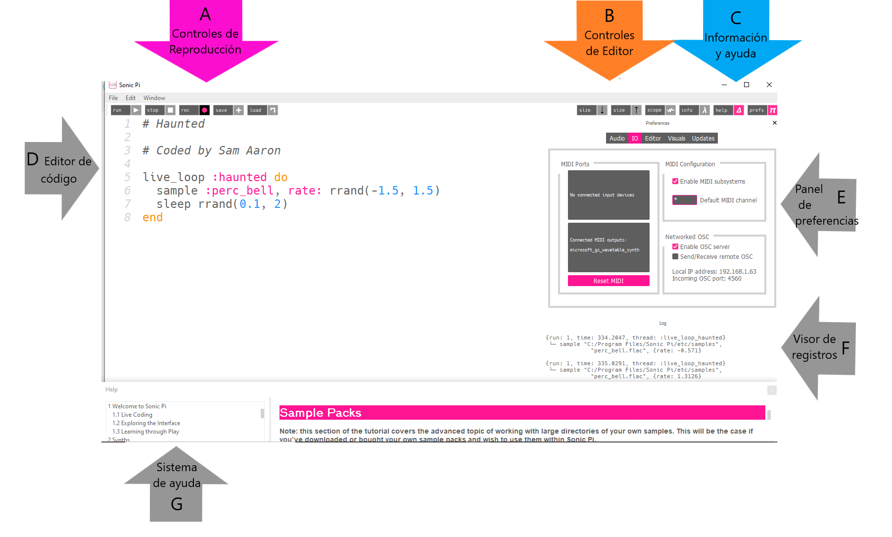

## Primeros sonidos con Sonic Pi



Esta es la interfaz de Sonic Pi que tiene tres ventanas principales. El más grande es para escribir tu código, y nosotros lo llamaremos el Panel de Programación. También hay un panel de salida que muestra información sobre tu programa mientras se ejecuta. Cuando haces clic en el botón **ayuda** en la parte superior de la ventana, el tercer panel aparece en la parte inferior mostrando información de ayuda. Esto contiene información sobre diferentes códigos que puedes probar y usar, así como diferentes sonidos de sintetizador, sonidos grabados, y mucho más.

- Inicia Sonic Pi desde el escritorio o el menú de aplicaciones.

- Selecciona **Buffer 1** y escriba:
    
    ```ruby
    play 60
    ```

- Haz clic en el ícono **reproducir** en la parte superior de la pantalla. ¿Qué pasa?

- ¿Qué pasa si escribes `pley 60` y haces clic en el ícono de reproducción?
    
    Este es un ejemplo de un error en tu código. En actividades posteriores, si el panel de error muestra texto sabrás que tienes un error que necesitas corregir. Puede ser que hayas escrito mal una palabra como `play`.

- Ahora escribe:
    
    ```ruby
    play 60
    play 67
    play 69
    ```

- Haz clic en el ícono de reproducción en la parte superior de la pantalla. ¿Qué ocurre?

- La computadora esta reproduciendo cada nota en secuencia (una tras otra), pero se escucha tan rápido que parece que se reproducen al mismo tiempo.
    
    Necesitamos que la computadora haga una pausa entre cada nota. Podemos hacer esto al escribir lo siguiente después de cada `play`:
    
    ```ruby
    sleep 1
    ```
    
    El valor introducido después de la palabra `sleep` representa el tiempo en segundos. Usar el valor 1 representa un segundo. ¿Qué escribirías por medio segundo?

- ¡Ahora escribe una secuencia de reproducción y pausa para hacer una melodía que suene genial!