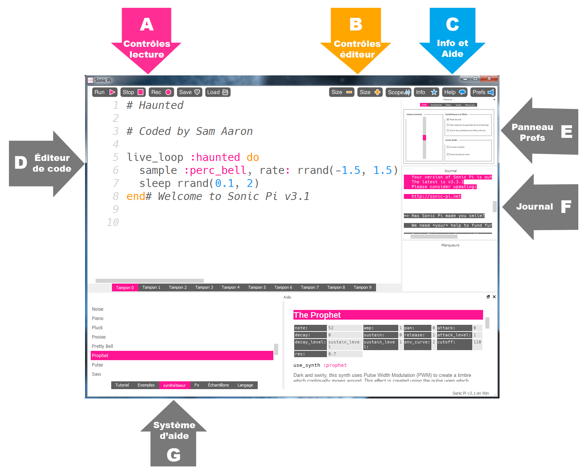

## Premiers sons avec Sonic Pi



Il s'agit de l'interface Sonic Pi ; elle est composée de trois fenêtres principales. La plus grande est pour écrire ton code, et nous l'appelons le panneau de programmation. Il y a aussi un panneau de sortie qui affiche des informations sur ton programme au moment de son exécution. Lorsque tu cliques sur le bouton **Help** en haut de la fenêtre, le troisième panneau apparaît en bas affichant la documentation d'aide. Ceci contient des informations sur différents codes que tu peux essayer d'utiliser, ainsi que différents sons de synthé, des échantillons, et bien plus encore.

- Lance Sonic Pi à partir du menu bureau ou des applications.

- Sélectionne **Tampon 1** et tape :
    
    ```ruby
    play 60
    ```

- Clique sur l'icône **Run** en haut de l'écran. Que se passe-t-il ?

- Que se passe-t-il si tu tapes `pley 60` et que tu cliques sur l'icône Run ?
    
    Ceci est un exemple de bogue dans ton code. Dans les activités ultérieures, si le panneau d'erreur affiche du texte, tu sauras que tu as un bogue que tu dois corriger. Il se peut que tu aies mal orthographié un mot comme `play`.

- Tape maintenant :
    
    ```ruby
    play 60
    play 67
    play 69
    ```

- Clique sur l'icône Run en haut de l'écran. Que se passe-t-il ?

- L'ordinateur joue chaque note dans la séquence (une après l'autre), mais cela se passe si vite que pour nous ils semblent jouer en même temps.
    
    Nous devons dire à l'ordinateur de faire une pause entre chaque note. Nous pouvons le faire en tapant ce qui suit après chaque `play` :
    
    ```ruby
    sleep 1
    ```
    
    La valeur saisie après le mot `sleep` représente le temps en secondes. Utiliser la valeur 1 représente une seconde. Que taperais-tu pour une demi-seconde ?

- Maintenant, écris une séquence de play et de sleep pour faire une musique vraiment cool !