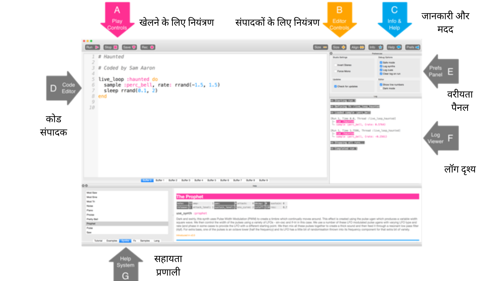

## पहले ध्वनि Sonic Pi के साथ



यह Sonic Pi इंटरफ़ेस है; इसकी तीन मुख्य विंडोज़ हैं। आपका कोड लिखने के लिए सबसे बड़ा है, और हम इसे प्रोग्रामिंग पैनल कहते हैं। एक आउटपुट पैनल भी है जो आपके प्रोग्राम के बारे में जानकारी दिखाता है जैसे-जैसे यह चलता है। जब आप **help** बटन पर क्लिक करते हैं जो विंडो के शीर्ष पर स्थित है, तीसरे पैनल में नीचे की ओर मदद के दस्तावेज प्रदर्शित होते हैं। इसमें अलग-अलग कोड के बारे में जानकारी होती है, जिन्हें आप आजमा सकते हैं और उपयोग कर सकते हैं, साथ ही अलग-अलग सिंथ ध्वनि, नमूने और बहुत कुछ कर सकते हैं।

- डेस्कटॉप या एप्लिकेशन मेनू से Sonic Pi लॉन्च करें।

- **बफर 1** का चयन करें और टाइप करें:
    
    ```ruby
    play 60
    ```

- **play** आइकन पर क्लिक करें जो स्क्रीन के शीर्ष पर है। क्या होता है?

- यदि आप `pley 60` टाइप करें और play आइकन पर क्लिक करें तो क्या होता है?
    
    यह आपके कोड में बग का एक उदाहरण है। बाद की गतिविधियों में, यदि error पैनल टेक्स्ट प्रदर्शित करता है तो आपको पता चल जाएगा कि यह​ एक बग है जिसे आपको ठीक करने की आवश्यकता है। यह हो सकता है कि आपने `play` जैसे किसी शब्द को गलत किया हो।

- अब टाइप करें:
    
    ```ruby
    play 60
    play 67
    play 69
    ```

- स्क्रीन के शीर्ष पर स्थित play आइकन पर क्लिक करें। क्या होता है?

- कंप्यूटर प्रत्येक नोट को क्रम में (एक के बाद एक) बजा रहा है, लेकिन यह इतनी तेजी से हो रहा है कि हमारे लिए वे ध्वनि करते हैं जैसे वे एक ही समय में चल​ रहे हों।
    
    हमें कंप्यूटर को बताने की आवश्यकता है कि वो प्रत्येक नोट के बीच मे ठहराव ले। हम प्रत्येक `play` के बाद निम्नलिखित टाइप करके ऐसा कर सकते हैं:
    
    ```ruby
    sleep 1
    ```
    
    `sleep` शब्द के बाद दर्ज किया गया मान सेकंड में समय का प्रतिनिधित्व करता है। मान 1 का उपयोग करना एक सेकंड का प्रतिनिधित्व करता है। आप आधे सेकंड के लिए क्या टाइप करेंगे?

- अब play और sleep का एक क्रम लिखें सुरीली धुन बनाने के लिए!