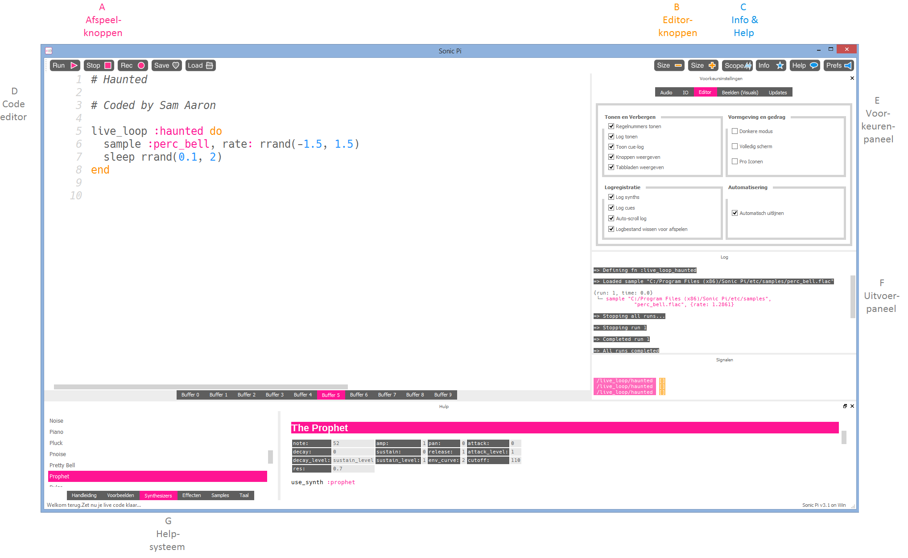

## Eerste geluiden met Sonic Pi



Dit is de Sonic Pi-interface; het heeft drie hoofdvensters. De grootste is om je code te schrijven, en we noemen dit het programmeerpaneel. Er is ook een uitvoerpaneel dat informatie over je programma toont terwijl het wordt uitgevoerd. Wanneer je op de knop **Help** boven in het venster klikt, wordt onderaan het derde paneel Help-documentatie weergegeven. Dit bevat informatie over diverse stukken code die je kunt uitproberen en gebruiken, en ook verschillende synth-geluiden, samples en nog veel meer.

- Start Sonic Pi vanuit het bureaublad of het toepassingenmenu.

- Selecteer **Buffer 1** en typ:
    
    ```ruby
    play 60
    ```

- Klik op het **Run** pictogram bovenaan het scherm. Wat gebeurt er?

- Wat gebeurt er als je `pley 60` typt en op het afspeelpictogram (Run) klikt?
    
    Dit is een voorbeeld van een bug in je code. In latere activiteiten, als het foutvenster tekst weergeeft, weet je dat je een fout hebt die je moet oplossen. Het kan zijn dat je een woord als `play`verkeerd gespeld hebt.

- Typ nu:
    
    ```ruby
    play 60
    play 67
    play 69
    ```

- Klik op het Run pictogram bovenaan het scherm. Wat gebeurt er?

- De computer speelt elke noot achter elkaar af (de een na de ander), maar het gebeurt zo snel dat het voor ons klinkt alsof ze tegelijkertijd spelen.
    
    We moeten de computer vertellen dat hij moet wachten tussen elke noot. We kunnen dit doen door na elke `play` het volgende te typen:
    
    ```ruby
    sleep 1
    ```
    
    De waarde ingevoerd na het woord `sleep` vertegenwoordigt de tijd in seconden. Het gebruik van de waarde 1 komt overeen met één seconde. Wat zou je invullen voor een halve seconde?

- Schrijf nu een reeks van play en sleep om een ​​cool klinkend deuntje te maken!