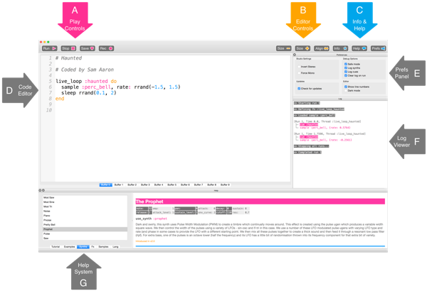

## Primele sunete cu Sonic Pi



Aceasta este interfața Sonic Pi; are trei ferestre principale. Cea mai mare este pentru scrierea codului tău și o numim Panou pentru programare. Există, de asemenea, un panou de ieșire care afișează informații despre program în timp ce rulează. Când dai click pe butonul **help** din partea de sus a ferestrei, un al treilea panou apare în partea de jos pentru a afișa documentația de ajutor. Acesta conține informații despre diferite bucăți de cod pe care le poți încerca și utiliza, precum și diferite sunete de sintetizator, eșantioane și multe altele.

- Lansează Sonic Pi de pe desktop sau din meniul de aplicații.

- Selectează **Buffer 1** și scrie:
    
    ```ruby
    play 60
    ```

- Dă click pe pictograma **play** din partea de sus a ecranului. Ce se întâmplă?

- Ce se întâmplă dacă introduci `pley 60` și dai click pe pictograma de redare?
    
    Acesta este un exemplu de eroare în codul tău. În activitățile următoare, dacă panoul de eroare afișează text, vei ști că ai o eroare pe care trebuie să o înlături. S-ar putea să fi scris greșit un cuvânt ca `play`.

- Acum introdu codul:
    
    ```ruby
    play 60
    play 67
    play 69
    ```

- Dă click pe pictograma de redare din partea de sus a ecranului. Ce se întâmplă?

- Calculatorul redă fiecare notă secvențial (una după alta), dar se întâmplă atât de repede încât pentru noi sună ca și când toate ar fi redate în același timp.
    
    Trebuie să-i spunem computerului să facă pauză după fiecare notă. Putem face acest lucru prin adăugarea următorului text după fiecare `play`:
    
    ```ruby
    sleep 1
    ```
    
    Valoarea introdusă după cuvântul `sleep` reprezintă durata pauzei în secunde. Valorea 1 reprezintă o secundă. Ce ai scrie pentru o jumătate de secundă?

- Acum, scrie o secvență de play și sleep pentru a crea o melodie interesantă!