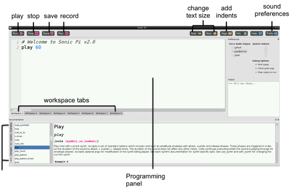

#Learn how to live code music with Sonic Pi 2

Ever wanted to make funky music like Daft Punk or Will.i.am but are not sure how to hold a cello, let alone play it?! Well Sonic Pi v2.0 could get you there.

##Step 1: First Sounds with Sonic Pi 2

This is the Sonic Pi application interface; it has three main windows. The largest one is for writing your code, and we call it the Programming Panel. The top right hand window is the Output Panel, and it displays information about your program as it runs. Underneath is the third window; this is the ‘Error Panel', which displays information if there is a problem or a bug with your program.